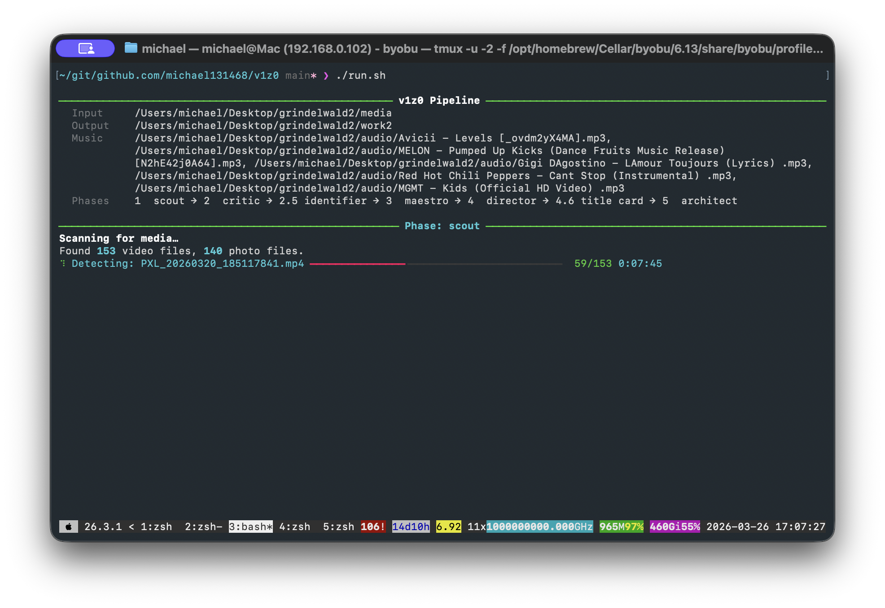
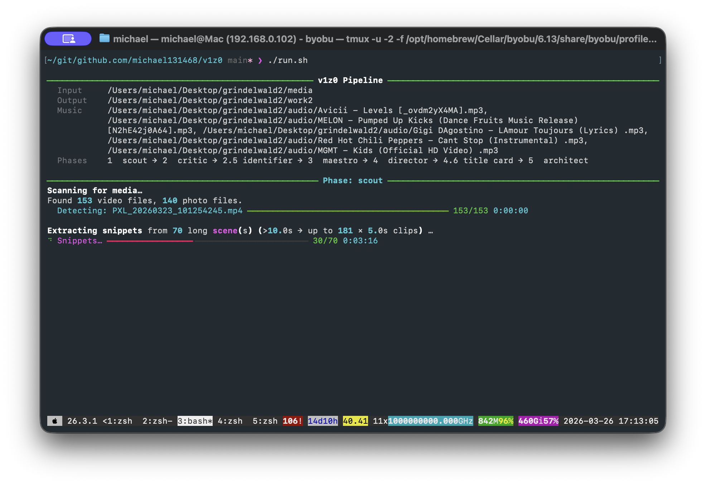
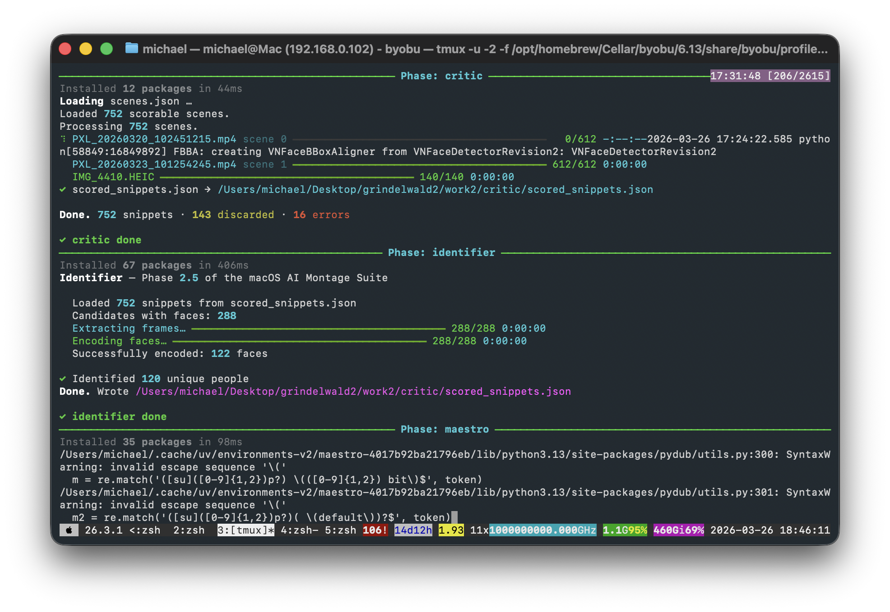
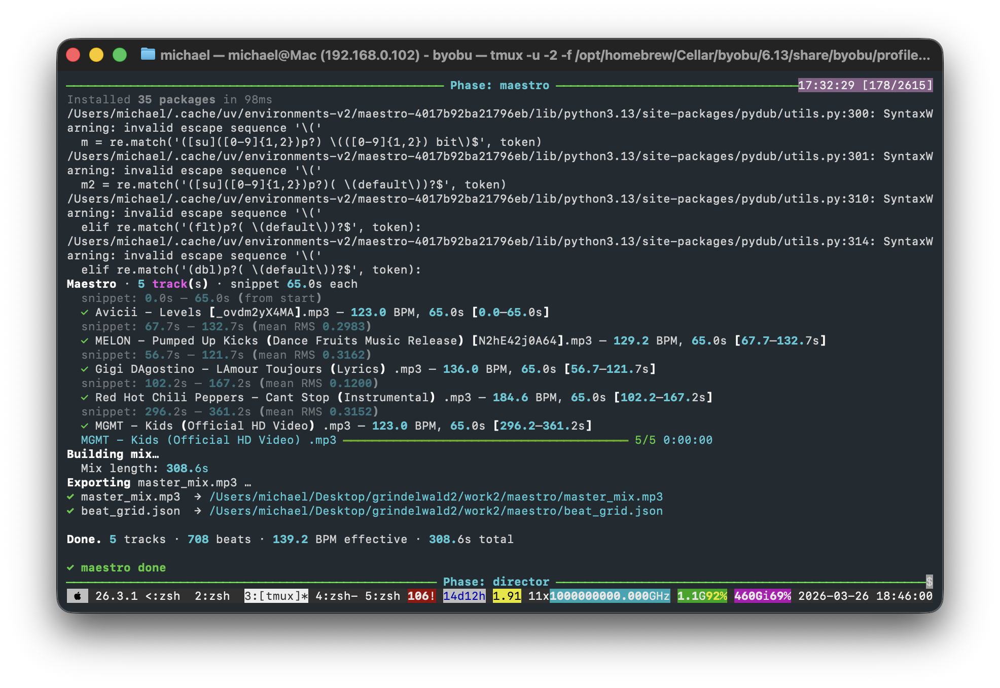
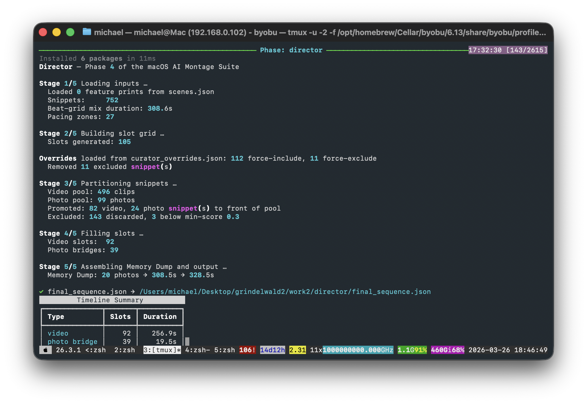
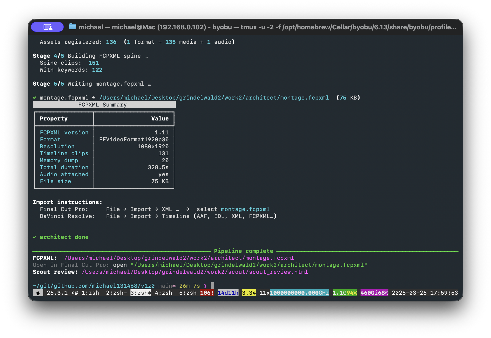
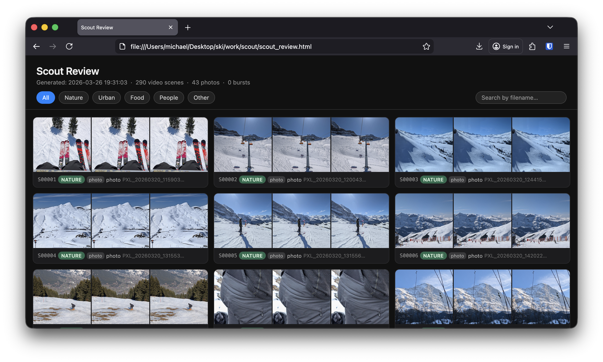
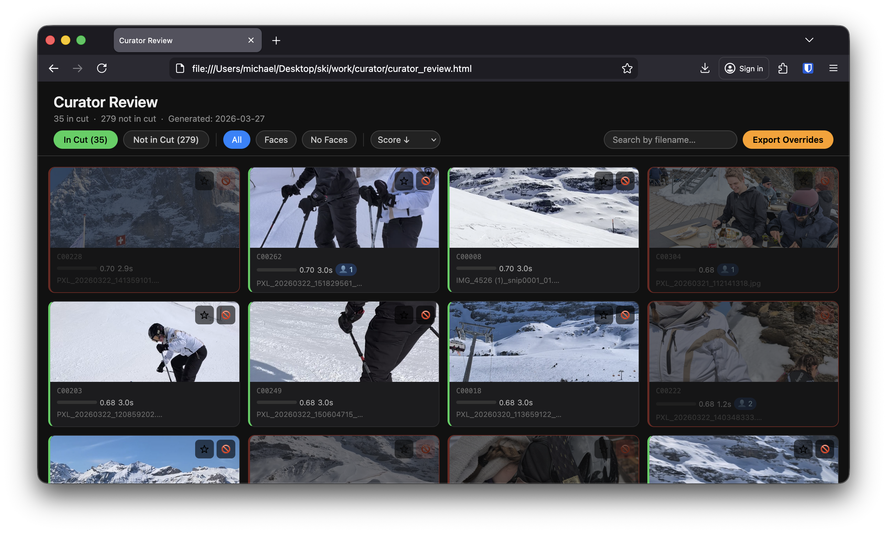

# v1z0

An AI-powered holiday montage pipeline for macOS. Point it at a folder of
photos and videos, give it some music, and it produces a beat-synced, curated
FCPXML ready to open in Final Cut Pro.

Under the hood it taps directly into Apple's on-device AI frameworks —
[**Vision**](https://developer.apple.com/documentation/vision) for scene
detection, saliency analysis, face detection, and image classification;
[**AVFoundation**](https://developer.apple.com/documentation/avfoundation)
for frame-accurate media inspection — so everything runs locally, fast, and
without any cloud API. Beat detection and music analysis use
[**librosa**](https://librosa.org), and the whole thing outputs **FCPXML
1.11**, the native interchange format for Final Cut Pro.

> **Requires Apple Silicon.** The Vision framework features used here
> (saliency, feature prints, face detection) rely on the Apple Neural Engine
> and are only available on ARM-based Macs (M1 or later).

> **Note:** This project is vibe coded. It scratches a personal itch and the
> codebase reflects that — contributions are not really expected or welcomed.

## Screenshots

<a href="docs/screenshot1.png"></a>
<a href="docs/screenshot2.png"></a>
<a href="docs/screenshot4.png"></a>
<a href="docs/screenshot3.png"></a>
<a href="docs/screenshot6.png"></a>
<a href="docs/screenshot7.png"></a>
<a href="docs/screenshot9.png"></a>
<a href="docs/screenshot8.png"></a>

## Requirements

- macOS on Apple Silicon (M1 or later) — required for the [Vision framework](https://developer.apple.com/documentation/vision)
- [uv](https://github.com/astral-sh/uv) — each script declares its own
  dependencies via PEP 723 inline metadata
- `ffmpeg` — `brew install ffmpeg`

## Quick Start

```bash
uv run pipeline.py \
  --input  /path/to/media \
  --output /path/to/work \
  --music  /path/to/track.mp3 \
  --title  "Grindelwald 2026" \
  --subtitle "Family Holiday"
```

Open the resulting `work/architect/montage.fcpxml` in Final Cut Pro.

---

## Pipeline Phases

See [docs/architecture.md](docs/architecture.md) for the overall design.

```
Phase 0.5  titler      — title card MP4
Phase 1    scout       — scan, detect scenes, extract snippets
Phase 2    critic      — score every clip
Phase 2.5  identifier  — cluster faces, tag person IDs
Phase 3    maestro     — analyse music, build beat grid
Phase 3.5  curator     — interactive HTML review (optional)
Phase 4    director    — select clips, assemble timeline
Phase 5    architect   — generate montage.fcpxml
```

### Phase 1 — [Scout](docs/scout.md)

Recursively scans a media directory for photos and videos. Detects scene cuts
in videos using PySceneDetect, groups rapid-fire photos into burst groups, and
analyses every frame with the macOS Vision framework (saliency, face detection,
labels).

**Highlights**
- **Snippet extraction** — automatically cuts 5-second clips out of long videos
  at their sharpest/most interesting moments (`--extract-snippets`). Multiple
  non-overlapping snippets can be cut per scene.
- **Media normalisation** — pre-renders all media to a common aspect ratio
  (landscape 1920×1080 or portrait 1080×1920) before scoring, using either
  letterbox padding or crop-to-fill (`--normalise landscape|portrait`,
  `--normalise-mode pad|crop`).
- **Resume support** — skips files already present in `scenes.json`, so
  interrupted runs continue where they left off.
- **Scout review** — generates a `scout_review.html` with thumbnails and
  metadata for every detected scene.

### Phase 2 — [Critic](docs/critic.md)

Scores every scene and photo snippet. Uses a sliding window over the Vision
analysis data to find the best sub-window, and penalises blurry, tilted, or
dark frames.

**Highlights**
- Composite score combining sharpness, saliency, face presence, tilt, and
  Vision confidence labels.
- Configurable blur and tilt thresholds.
- Resume support — skips already-scored snippets.

### Phase 2.5 — Identifier *(optional)*

Extracts face embeddings (DeepFace / Facenet) from each snippet's
representative frame and clusters them with DBSCAN to assign persistent person
IDs (`P001`, `P002`, …). The director can use these IDs to control face-clip
diversity.

### Phase 3 — [Maestro](docs/maestro.md)

Analyses each music track with librosa: detects BPM, beats, downbeats, and
energy profile. Builds a crossfaded master mix and writes a `beat_grid.json`
for the director to snap clips to.

**Highlights**
- **Multi-track support** — pass `--music` multiple times; tracks are
  crossfaded together.
- **First track plays from the start** — subsequent tracks use their
  peak-energy window so the opening always has a strong rhythmic entry.
- **Snippet mode** — trim each track to its highest-energy N-second window
  (`--snippet-duration`), snapping the cut point to the nearest downbeat.
- Exports `master_mix.mp3` alongside the beat grid.

### Phase 3.5 — Curator *(optional)*

Generates a `curator_review.html` that shows every snippet — separated into *In
Cut* and *Not in Cut* tabs — with preview frames, scores, and metadata.

**Highlights**
- **Pin clips** — force a snippet into the timeline regardless of its score.
- **Exclude clips** — permanently remove a snippet from consideration.
- One-click download of `curator_overrides.json`, which is passed back to the
  director via `--overrides`.

### Phase 4 — [Director](docs/director.md)

Selects clips from the scored pool and assembles them into a beat-synced
timeline. Alternates between video clips and photo bridges, ends with a
memory-dump photo sequence.

**Highlights**
- **Override support** — `--overrides curator_overrides.json` force-includes
  pinned clips and removes excluded ones before selection.
- **Visual diversity** — uses Vision feature prints to avoid placing visually
  similar clips near each other.
- **People controls** — `--people-boost` and `--people-ratio` tune how
  prominently face clips appear.
- **Source diversity** — `--max-clips-per-source` limits how many clips come
  from the same source file.
- **Photo bridges** — inserts a photo every N video slots to vary the pace
  (`--photo-bridge-interval`).
- **Memory dump** — a run of photos at the end of the timeline as end-credits
  (`--memory-dump-count`).

### Phase 5 — [Architect](docs/architect.md)

Reads `final_sequence.json` and `beat_grid.json` and writes a valid
`montage.fcpxml` for Final Cut Pro.

**Highlights**
- **Orientation control** — force the FCP sequence to landscape or portrait
  (`--orientation landscape|portrait`), matching the scout normalisation mode.
- **Title clip** — prepends a title card as the first spine element
  (`--title-clip`).
- **Beat-synced audio** — attaches `master_mix.mp3` to the timeline, offset
  correctly.
- **Keyword metadata** — Vision labels are embedded as FCP keyword ranges on
  each clip.
- FCPXML 1.11, compatible with Final Cut Pro 10.6+.

### Phase 0.5 — Titler

> **Note:** The titler is currently broken and the output quality is not great.
> However, the placeholder clip it inserts into the FCPXML timeline is useful —
> you can replace or overlay it directly in Final Cut Pro with a proper title.

Generates a title card MP4 from a background photo with centred text overlay.

**Highlights**
- Auto-selects the highest-scoring photo from `scored_snippets.json` if no
  photo is specified.
- Fade in / fade out.
- Dark overlay for text legibility (configurable opacity).
- Landscape or portrait output to match the rest of the pipeline.

---

## Curation Workflow

Run the full pipeline once, then iterate on the cut without re-running the
expensive scout/critic phases:

```bash
# 1. Generate the HTML review
uv run curator.py \
  --snippets work/critic/scored_snippets.json \
  --sequence work/director/final_sequence.json \
  --output   work/curator

# 2. Open work/curator/curator_review.html, pin/exclude clips, download curator_overrides.json

# 3. Re-run from director onwards
uv run pipeline.py \
  --input  /path/to/media \
  --output work \
  --music  /path/to/track.mp3 \
  --skip-scout --skip-critic --skip-identifier --skip-maestro \
  --overrides work/curator/curator_overrides.json
```

---

## Pipeline Options Reference

| Flag | Default | Description |
|------|---------|-------------|
| `--input` | — | Source media directory |
| `--output` | — | Work directory |
| `--music` | — | Music file(s); repeat for multiple tracks |
| `--music-snippet-duration` | off | Trim tracks 2–N to peak-energy N seconds |
| `--title` | off | Title card text; triggers titler before architect |
| `--subtitle` | — | Title card subtitle |
| `--orientation` | auto | FCP sequence + title card orientation |
| `--normalise` | none | Pre-render media to `landscape` or `portrait` |
| `--normalise-mode` | pad | `pad` (black bars) or `crop` (fill) |
| `--extract-snippets` | off | Cut short clips from long videos |
| `--snippet-duration` | 5.0 | Extracted clip length in seconds |
| `--snippet-max-per-scene` | 0 (unlimited) | Cap snippets per long scene |
| `--min-score` | 0.3 | Minimum score for clip selection |
| `--people-boost` | 0.0 | Score bonus for clips with faces |
| `--max-clips-per-source` | 3 | Limit clips from a single source file |
| `--overrides` | off | Path to `curator_overrides.json` |
| `--skip-scout` … `--skip-architect` | off | Skip individual phases |
| `--workers` | 4 | Parallel workers |
| `--verbose` | off | Print phase commands |

---

## Running Phases Individually

Each script is a self-contained `uv run` script with its own dependency declaration:

```bash
uv run scout.py      --input /media --output work/scout
uv run critic.py     --scenes work/scout/scenes.json --output work/critic
uv run identifier.py --snippets work/critic/scored_snippets.json
uv run maestro.py    --music track.mp3 --output work/maestro
uv run curator.py    --snippets work/critic/scored_snippets.json --sequence work/director/final_sequence.json
uv run director.py   --snippets work/critic/scored_snippets.json --beats work/maestro/beat_grid.json --output work/director
uv run titler.py     --title "Holiday 2026" --snippets work/critic/scored_snippets.json --output work/titler/title_card.mp4
uv run architect.py  --sequence work/director/final_sequence.json --beats work/maestro/beat_grid.json --output work/architect
```
